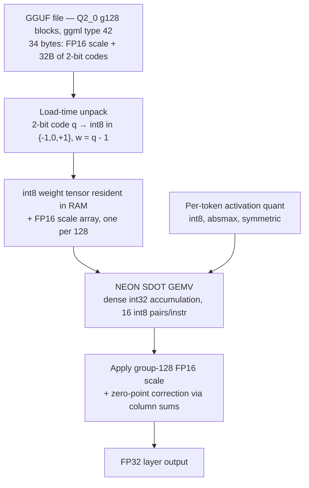
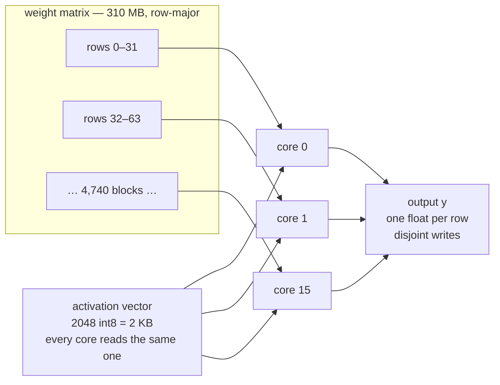

# 🌱 Ternary Inference Engine in Mojo — Working Plan

**Status:** M0 ✅ · M1 ✅ · M2 ✅ · M3 ✅ · M4 ✅ — **M5 (27B) is a deliberate decision point, not a queued task** · **Started:** 2026-09-08 · **Last updated:** 2026-09-08

## 📊 Status — measured, not projected

**Works:** loads real Bonsai 1.7B and 8B from GGUF, generates correct text. Output matches
HuggingFace transformers exactly.

**Speed:** 34.7 tok/s (1.7B), 12.9 tok/s (8B).

**Same machine, llama.cpp:** 58.9 / 25.7 on CPU, 327 / 129 on GPU.

**So:** correct engine, ~2× slower than llama.cpp's CPU, ~10× slower than its GPU.
**The performance goal is not met.** The best kernel we have is CPU packed weights at 1.06× over
the original — three GPU kernel shapes were tried and none beat the CPU.

`README.md` carries this same summary, plus how to rebuild the large directories this repo omits.
**Supersedes:** `IDEA_ORIG.md` (kept for reference; four of its technical claims are wrong — see *Corrections* #1, #2, #3, #6)

---

## 🎯 Goal

**A high-performance inference engine for ternary models, written in Mojo** — combining two
bets in one project: ternary (1.58-bit) weights, and a language built for accelerators. On an
M4 Max, 128GB. Ship it on **Ternary-Bonsai-1.7B** and scale up the Bonsai family.

Performance is the point, not an afterthought. The bar is the best thing already running on this
machine, which is llama.cpp — see *Status* immediately below.

*(Earlier drafts of this file described the project as recreational, "two projects for the price
of one: learn Mojo and learn low-bit inference." That framing was written by Claude in a prior
session, not by Ralph, and it caused a session's worth of wrong recommendations — most of all the
argument that the project was finished at 2× slower than the reference. It is not the goal.)*

---

## 🪜 The Ladder

PrismML publishes Bonsai at **1.7B / 4B / 8B / 27B**, all in the *same* `Q2_0` (g128)
quantization format. **That format is the only thing all four share** — read from the GGUF
headers on 2026-09-08, correcting this document's original claim of one common tokenizer and
backbone.

| Rung | Model | `general.architecture` | Context | Purpose |
|---|---|---|---|---|
| 0 | `Ternary-Bonsai-1.7B` | `qwen3` — dense, 28 layers | 32K | Get the kernel right. |
| 1 | `Ternary-Bonsai-4B` | `qwen3` — dense | 32K | First real memory-bandwidth pressure. |
| 2 | `Ternary-Bonsai-8B` | `qwen3` — dense | 64K | Multi-threaded prefill matters here. |
| 3 | `Ternary-Bonsai-27B` | **`qwen35` — hybrid SSM, 64 layers, multimodal** | 262K | A second engine, not a bigger one. |

**Rungs 0–2 are a genuine scale-up of one another** — plain Qwen3 dense attention, same
tokenizer family, the same code with bigger tensors. That part of the original plan holds.

**Rung 3 is a different model, not a larger one.** Only every 4th layer is attention
(`full_attention_interval: 4`); the other **48 of 64 are Mamba-style state-space layers**
(`mamba_ssm_dtype`, a 4-wide causal conv, 16 key heads against 48 value heads, swish output
gate). It also carries a **different tokenizer** (248,320 tokens vs 151,669), 262K context,
and a vision tower shipped as separate `mmproj-*.gguf` files. Treat 27B as a second project
that reuses the kernel, not as rung 3 of one ladder.

(The "Qwen3.6" in earlier drafts of this document was never right; the files say `qwen3` and
`qwen35`.)

---

## 🧱 What We Actually Build



**The load-time unpack is the load-bearing design decision.** See Correction #2.

---

## 🧠 How It Actually Runs

The diagram above is the data path for *one* dot product. This is what the machine does with
sixteen cores, and why the answer is always "memory", never "arithmetic".

### What each core is doing

The weight matrix is split **by rows**. Each core is handed a block of rows and computes those
outputs start to finish, alone. For the 310 MB `token_embd.weight`: 151,669 rows in blocks of
32, so ~4,740 work items dealt out to 16 workers.



For a single row, a core walks that row's 2,048 weights, feeds them to `sdot` 16 bytes at a
time against the activation vector, accumulates in int32, applies the FP16 scale once per 128
weights, and writes one float. Then the next row in its block.

### Why it parallelizes with no coordination at all

| | size | access pattern |
|---|---|---|
| **weights** | 310 MB | each core reads a **disjoint** slice, once, never reused |
| **activations** | 2 KB | **all 16 cores read the same vector** — sits in each core's L1, effectively free |
| **outputs** | one float per row | each core writes only its own rows — no overlap |

No locks, no atomics, no shared mutable state. `parallelize` just hands out row blocks.

### Why that makes it bandwidth-bound

Look at the asymmetry: an enormous stream of weights touched **exactly once**, against a tiny
vector reused constantly. There is no arithmetic reuse to hide the reads behind — the moment a
weight arrives it is used once and discarded. That is the definition of a memory-bound kernel,
and it is why every number in this document is reported as **GB/s of weight bytes**, not
FLOP/s.

It is also why Correction #1 holds. Skipping the zero weights would save arithmetic we are not
short of, while doing nothing about the bytes, which is what we *are* short of — and the branch
would break the SIMD pipeline that keeps the loads flowing.

### The one place per-core speed still mattered

Being memory-bound does not mean per-core arithmetic is irrelevant — it means it stops
mattering *once cores can outrun the bus*. We caught the moment it still mattered:

- one core, portable SIMD: **33 GB/s**
- sixteen cores, same kernel: **170 GB/s** — nowhere near 16 × 33, as expected
- but a pure-read probe with almost no math: **200–256 GB/s**

So memory could deliver more than 170. Something else was capping it. The hypothesis was that
each core still spent too long per byte to keep its share of the memory pipeline saturated —
which predicts that making cores *compute* faster should raise the parallel number, even though
nothing about memory changes.

`sdot` did exactly that: one core 33 → **60 GB/s**, and the parallel result 170 → **217.7
GB/s**, landing inside the roofline band. Had we truly been memory-bound at 170, a faster
kernel would have changed nothing and merely left the cores idler. The number moved, so the
diagnosis was right. See M1.

The remaining gap — 218 against a ~250 roofline — is the honest target for M3.

---

## ⚠️ Corrections to `IDEA_ORIG.md`

These are not nitpicks — building the original Step 1 and Step 2 as written would produce
an engine slower than PyTorch.

### 1. Do not skip zero weights
The original plan's centerpiece — *"if the weight is 0 the CPU skips the step completely"* —
is a myth. Litespark's paper states plainly that weights are **not skipped**; the
implementation uses **dense** SIMD dot products. Per-weight branching serializes the SIMD
pipeline and costs far more than the multiply it avoids.

The ternary win is **memory bandwidth**, not skipped arithmetic. Decode is bandwidth-bound;
that is where the 50× lives.

### 2. Do not unpack 2-bit weights inside the matmul
Litespark stores ternary weights as **int8**, not packed 2-bit, and says why:
*"2-bit packing would require unpacking weights before every computation, negating the
performance benefit."*

Unpack **once at model load**. Cost: weights inflate ~4× in RAM.

| Model | On disk (2-bit) | Unpacked int8 |
|---|---|---|
| 1.7B | ~0.4 GB | ~1.7 GB |
| 8B | ~1.8 GB | ~8 GB |
| 27B | ~5.9 GB | ~27 GB |

27GB is fine in 128GB — but it does mean we forfeit the "5.9GB model" headline. If we
later want it back, the middle path is a **per-tile unpack into an L2-resident int8 buffer**,
amortized across the tile's whole GEMM. Defer that until rung 2 proves it's needed.

### 3. AMX is not reachable from Mojo — and neither is SME, but SDOT and I8MM are
Apple's AMX coprocessor is undocumented and accessible only via Accelerate/BNNS. Litespark
confirms this — their AMX path exists only as an Accelerate-backed fp32 accuracy mode.

**SME is a real thing on this chip, and still not reachable.** `sysctl` on this M4 Max reports
`FEAT_SME: 1`, `FEAT_SME2: 1`, `SME_I8I32: 1` (int8×int8→int32 outer product — precisely the
ternary primitive) and `sme_max_svl_b: 64` (512-bit streaming vectors, a 64×64 int8 ZA tile).
Unlike AMX it is documented ARM architecture. But Mojo cannot express it: SME intrinsics take
LLVM **scalable** vector types (`<vscale x 16 x i8>`) while Mojo's `SIMD` is fixed-width, and
streaming mode needs a function-level attribute Mojo has no syntax for. Calling
`llvm.aarch64.sme.smopa.wide.nxv16i8` crashes the backend outright:
`LLVM ERROR: Do not know how to promote this operator's operand!` during AArch64 instruction
selection. Verified 2026-09-08 on Mojo 1.0.0. Accelerate/BNNS is how Apple reaches SME.

**What *is* reachable, verified working:** `std.sys.llvm_intrinsic` reaches both NEON int8
matrix instructions directly.

```mojo
from std.sys import llvm_intrinsic
comptime I32x4 = SIMD[DType.int32, 4]
comptime I8x16 = SIMD[DType.int8, 16]

# SDOT — 4 groups of 4 int8 pairs -> 4 int32 lanes
var d = llvm_intrinsic["llvm.aarch64.neon.sdot", I32x4](acc, a, b)

# SMMLA (FEAT_I8MM: 1) — 2x8 by 8x2 matrix multiply-accumulate -> 2x2 int32
var m = llvm_intrinsic["llvm.aarch64.neon.smmla", I32x4](acc, a, b)
```

`smmla` is the underrated one: it is genuine matrix hardware in plain NEON, needs no streaming
mode, and does 8 MACs per output element against SDOT's 4. It is the first thing to try when
M1 goes after the ~1.5× of per-core headroom the bandwidth baseline exposed.

Target NEON — SDOT first, then SMMLA. Treat Accelerate as a correctness oracle, not a speed
path.

### 4. Prefill is not the problem the original doc implies
Litespark on M4 vs PyTorch: **prefill 9.2×**, **decode 52×**. Prefill is a smaller win
because it is compute-bound where decode is bandwidth-bound — but it is still a win, not a
regression. No rescue plan needed.

### 5. Scope
Not a weekend. Rung 0 is a few solid weekends. Rung 3 is a real project.

### 6. The M4's Neural Engine is not the hardware that comment is about
*Worth knowing, not a show-stopper — nothing in the plan changes because of it.*

`IDEA_ORIG.md` says newer chips "(like the M5 and M6 generations) are introducing dedicated
Neural Accelerators baked right into the architecture to handle these ultra-low-bit matrix
operations natively." Two separate things are being conflated, and neither blocks us:

| | What it is | Reachable how |
|---|---|---|
| **Neural Engine (ANE)** — on this M4 | Separate coprocessor, present since M1 | Core ML only, under strict op/shape constraints. Not via Metal, not via Mojo. Custom kernels are out. |
| **Neural Accelerators** — M5 and later | Matrix units *inside each GPU core*, i.e. tensor cores | Metal 4 TensorOps / Metal Performance Primitives |

So this M4 is not "missing" the ANE's low-bit capability — the ANE is simply not programmable
for a custom ternary GEMV on any Apple chip, M5 included. The M5 addition is a GPU feature.

The "ultra-low-bit natively" claim is also ahead of itself: M5's accelerators do FP16 and INT8
in hardware (INT8 reportedly the weaker path), Metal tensors gained 4- and 8-bit integers in
macOS 26, and **2-bit integers arrive in macOS 27** with E8M0 block scales.

**Why it doesn't change the plan.** This CPU has **NEON SDOT** — genuine int8 dot-product
hardware, and exactly what M1 targets. Meanwhile M5's accelerators attack *compute-bound* work,
i.e. prefill. Correction #4's split is prefill 9.2× / decode 52×, and our own measurement has
decode pinned by memory bandwidth (~170 GB/s achieved against a ~210–256 GB/s read roofline).
Matrix units do not widen a memory bus. The win this engine chases is not one an M5 would have
handed us.

**One lead, unverified:** arXiv 2606.12765, *"Rigel: Reverse-Engineering the Metal 4.1 Tensor
Compute Path on the Apple M4 Max GPU"* — implies this exact chip has *some* Metal 4 tensor
path. It is the paper to read if the tensor-core question reopens.

**Note added 2026-09-08:** none of this means the GPU is out of reach. Writing ordinary Mojo
kernels for the Apple GPU works today — see *The GPU Is Available* below. What is unreachable is
the *matrix* hardware (AMX, SME, the ANE), not the GPU.

---

## 🧰 Assets We Have

| Asset | Why it matters |
|---|---|
| `PrismML-Eng/llama.cpp` (prism branch) | Reference Q2_0 kernels, CPU NEON + Metal. **Built at `vendor/llama.cpp` (`d8d96cf`).** CPU 58.9 tok/s, Metal 327 tok/s on the 1.7B. |
| [llama.cpp discussion #22019](https://github.com/ggml-org/llama.cpp/discussions/22019) | The `Q2_0_g128` block layout spec. |
| [llama.cpp PR #24448](https://github.com/ggml-org/llama.cpp/pull/24448) | Upstream Q2_0 CPU implementation in review. |
| Bonsai-27B already in LM Studio | Free correctness oracle **and** the speed bar we must beat. |
| [Litespark paper (arXiv 2605.06485)](https://arxiv.org/html/2605.06485v1) | Published NEON SDOT design + numbers to sanity-check against. |
| M4 Max / 128GB | Memory ceiling is a non-issue all the way to 27B. |

**The honest bar:** LM Studio already runs Bonsai-27B on this machine. Our engine is a
learning exercise until it beats that number. Measure against it from day one.

---

### Shared tooling — not milestone work

Two items serve several milestones at once, so they live here rather than inside any one of them.
Neither is M3 or M4 work; misfiling them as such is how they end up skipped.

**`oracle/dump_reference.py` — built, working.** The correctness oracle. Runs the model through
HuggingFace transformers and dumps reference activations. Deliberately external: transformers'
Qwen3 is authored by someone else and is what the model was released against, so it cannot share
a misunderstanding with our Mojo. It **scales to every rung** — `-unpacked` repos exist for 4B,
8B and 27B too — so correctness is already covered up the ladder.

**`PrismML-Eng/llama.cpp` (prism branch) — built 2026-09-08 at `vendor/llama.cpp`.** The
*speed* reference; it closed M3's bar. Two things to know when using it:

- **It cannot load the `*-Q2_0.gguf` files** (legacy type 42 = group 128). Use `*-PQ2_0.gguf`
  (type 142). Our own reader accepts both.
- It applies the model's **chat template** by default, so `llama-cli` output is not directly
  comparable to our raw-completion output. That difference is the template, not a
  discrepancy — correctness is established against the transformers oracle instead.

```bash
cd /Users/rbutler/Desktop/DEMO/MOJO_TERNARY/vendor/llama.cpp
cmake -B build -DCMAKE_BUILD_TYPE=Release -DLLAMA_CURL=OFF
cmake --build build -j 16 --target llama-bench llama-cli
# CPU baseline (the fair comparison — we are CPU-only):
./build/bin/llama-bench -m <path>/Ternary-Bonsai-1.7B-PQ2_0.gguf -p 0 -n 128 -ngl 0 -t 16 -r 3
```

---

## 🏃 Running It Yourself

Three programs, all in this directory. Mojo is **not** on `PATH` — it lives in the project
venv, so always invoke it as `.venv/bin/mojo`. From
`/Users/rbutler/Desktop/DEMO/MOJO_TERNARY`:

```bash
# One-time setup (already done; only needed for a fresh clone)
uv sync

# M0 — read the real GGUF, verify the block layout, verify dequantization
.venv/bin/mojo run gguf_meta.mojo
# ends with: "M0 DONE." and 0 structural mismatches

# M1 — the real ternary GEMV: scalar vs SIMD vs NEON sdot vs sdot+threads
.venv/bin/mojo run q2_gemv.mojo                       # blk.0.ffn_gate.weight, 12.6 MB
.venv/bin/mojo run q2_gemv.mojo token_embd.weight     # 310 MB — the DRAM-bound case
# ends with: "M1 DONE." plus a GB/s table

# The synthetic kernel benchmark — no model file needed, pure bandwidth probe
.venv/bin/mojo run q2_dot.mojo

# The GPU kernel, verified against the CPU one (spoiler: the GPU loses)
.venv/bin/mojo run gpu_gemv.mojo token_embd.weight

# Packed weights: CPU int8 vs CPU packed vs GPU packed, all three checked against each other
.venv/bin/mojo run packed_gemv.mojo token_embd.weight

# M2 — full forward pass, checked against transformers
# First generate the reference (needs torch; ~15s, downloads into the uv cache):
uv run --with torch --with transformers --with safetensors oracle/dump_reference.py
# Then run ours — diffs against the reference, then generates and decodes text:
.venv/bin/mojo run m2.mojo
# top-5 should be 12095 / 32671 / 30 / 537 / 279 — ' Paris' first at 17.6968
# then: "The capital of France is Paris. The capital of France is Paris. ..."
# (~22s: the graph is still on the slow fp32 GEMV until M3)
```

| File | What it is |
|---|---|
| `gguf.mojo` | Shared GGUF reader: header parsing, tensor lookup, Q2_0 dequantization. Imported by the two tools below; not run directly. |
| `gguf_meta.mojo` | **M0.** Prints the container metadata, confirms the 34-byte/128-weight layout from tensor offsets, dequantizes ternary tensors and diffs them per-block against the F16 build. |
| `q2_gemv.mojo` | **M1.** Loads a real ternary tensor, unpacks once to int8, runs four GEMV kernels, checks them against an f64 reference, and times them. |
| `q2_dot.mojo` | Synthetic 16384² kernel benchmark with a read-only bandwidth roofline. Needs no model; useful for isolating memory behaviour from format concerns. |
| `model.mojo` | Model loader: all 310 tensors, parallel ternary unpack, shape checks, plus an fp32 GEMV. Imported, not run directly. |
| `m2.mojo` | **M2.** Runs the full 28-block forward pass, diffs four checkpoints against the transformers reference, then generates and decodes text. |
| `tokenizer.mojo` | GPT-2 byte-level **decoder**, pure Mojo, vocab read from the GGUF. Encoding is deferred (needs a regex Mojo lacks). |
| `oracle/dump_reference.py` | The external oracle. Runs the model through HuggingFace transformers and dumps reference activations for `m2.mojo` to read. |
| `gpu_gemv.mojo` | The ternary GEMV as an Apple **GPU** kernel, verified against the CPU one. Measured **slower** than the CPU — see *The GPU Is Available*. |
| `packed_gemv.mojo` | Packed weights (2.25 bits/weight, never expanded): CPU version is bit-exact and 1.06× faster; GPU version is correct but only par. The current best kernel and the open problem. |
| `README.md` | Measured status, and how to recreate the omitted `.venv/`, `vendor/` and `oracle/ref/`. |
| `vendor/llama.cpp` | The reference implementation, built. `d8d96cf`. |

Both `gguf_meta.mojo` and `q2_gemv.mojo` **raise on failure** rather than printing a warning —
they are regression gates, so a silent pass is a real pass. Any argument can be overridden:
`q2_gemv.mojo [tensor-name] [gguf-path]`, `gguf_meta.mojo [q2-path] [f16-path]`.

Model files live in the HuggingFace cache, reachable via `~/MODELS/huggingface/`:
`~/.cache/huggingface/hub/models--prism-ml--Ternary-Bonsai-1.7B-gguf/snapshots/<hash>/`
(both `Ternary-Bonsai-1.7B-Q2_0.gguf` and the `-F16.gguf` reference). Fetch with
`huggingface-cli download prism-ml/Ternary-Bonsai-1.7B-gguf <filename>`.

---

## 🗺️ Milestones

### M0 — Format reader  ✅ **DONE 2026-09-08**
Parse GGUF headers and `Q2_0` (g128) blocks in Mojo. Dump a weight tensor, dequantize in
plain scalar Mojo, and match a reference bit-for-bit. **No SIMD yet.**
*Done when:* a dequantized tensor matches the reference to the last bit.

**Header parsing: done** (`gguf_meta.mojo`). Verified against the 1.7B file, not the README:

- the ternary **ggml type id is 42** — undocumented, absent from mainline ggml
  (`general.file_type = 41`, alignment 32)
- the **34-byte / 128-weight block layout is confirmed**: predicted padded tensor sizes match
  the gaps between consecutive tensor offsets across **196 ternary tensors, 0 mismatches**
- 1.7B contains 310 tensors — 197 ternary (1,719,904,256 weights) plus 113 F32 norms

**Dequantization: done.** `gguf_meta.mojo` dequantizes in plain scalar Mojo and diffs against
the repo's own `Ternary-Bonsai-1.7B-F16.gguf`, judged **per block** — 128 weights share one
FP16 scale, so a layout, code-mapping or scale-offset bug corrupts a block in a *pattern*,
while a mere scale disagreement shows up as one constant ratio across the whole block. That
distinction is measured, not assumed.

Across 16 tensors / 106,954,752 weights:

| | |
|---|---|
| blocks bit-exact | 835,539 |
| blocks differing only by the stored FP16 scale | 45 (0.005%) |
| **blocks with a structural mismatch** | **0** |
| `q = 3` codes seen | **0** — the reserved code point really is unused |

The code mapping is confirmed independently: the q-histogram matches the sign census exactly
(q=0 → negative, q=1 → zero, q=2 → positive), so `w = q - 1` is right.

The 45 outlier blocks are a discrepancy in *PrismML's* own F16↔Q2_0 pipeline, not in this
reader — every weight in such a block scales by one consistent ratio, up to 0.76% off. Our
values reproduce the Q2_0 bytes faithfully in every case.

**Optional:** `PrismML-Eng/llama.cpp` would give independent confirmation from a second
implementation, but it needs a build and the per-block analysis above already localises every
disagreement to their scale, not our arithmetic.

### M1 — The kernel  ✅ **DONE 2026-09-08**
NEON SDOT int8 GEMV in Mojo (`q2_gemv.mojo`), on real weights out of the GGUF. Dense, no
zero-skipping. Per-token absmax activation quant, group-128 FP16 scale application.
*Done when:* single-layer output matches reference within fp tolerance, and the kernel
beats a naive Mojo scalar loop by >10×. **Both met.**

**Correctness.** Max relative error against a **float64** reference using the same weights and
the same quantized activations: **5.9e-08** — fp32 epsilon, i.e. exact. All four kernels
(scalar, portable SIMD, sdot, sdot+threads) are **bit-identical on every row**.

Two notes on how that is measured, because the first attempt got it wrong. The reference must
be *more* accurate than the kernel under test — ours accumulates exactly in int32 per block of
128, so an fp32 reference summing 2048 terms sequentially is the less accurate of the two and
grading against it measures the reference's error (it reported 4.9e-04 and looked like a bug).
And relative error needs a data-driven floor: rows whose terms cancel show enormous relative
error from a trivial absolute one.

**Speed.** GB/s of weight bytes streamed; min of 20 runs.

| kernel | 12.6 MB tensor | 310 MB tensor (DRAM-bound) |
|---|---|---|
| scalar | 2.9 GB/s | 2.5 GB/s |
| portable SIMD (widen then multiply) | 36.0 | 32.8 |
| **NEON `sdot`** | **65.5** | **60.1** |
| `sdot` + 16 threads | 172.4 | **217.7** |
| vs scalar | 22.5× / 59.2× | 24.1× / **87.2×** |

**`sdot` is worth 1.83× over portable SIMD**, consistently at both sizes. That answers the
question Correction #3 left open. Reaching it needs no assembly — one
`llvm_intrinsic["llvm.aarch64.neon.sdot", ...]` call.

**It also moved the parallel wall.** `q2_dot.mojo`'s widen-based kernel plateaued at ~170 GB/s
no matter the thread count, while a read-only roofline reached 200–256. Raising the per-core
ceiling from 33 to 60 GB/s lifted the parallel result to **217.7 GB/s** — the prediction in
that analysis, confirmed. Per-core instruction cost really was the binding constraint.

**Zero-point correction was deleted, not implemented.** Both sides are symmetric — weights are
{-1,0,+1} and activations are absmax int8 — so both zero-points are 0 and the correction terms
vanish. The original milestone text called for column sums that are provably unnecessary here.

**One thing to watch in M2:** measured against a *full-precision* reference, int8 activation
quantization costs up to 0.30 relative error on the worst row (0.017 absolute). That is
quantization cost, not a bug, but it may prove too coarse once errors compound across 28
layers. Revisit if M2's output distribution drifts from LM Studio's.

### M2 — Forward pass, 1.7B  ✅ **DONE 2026-09-08**
Wire the full graph: embeddings, attention, FFN, sampling. Start in plain fp32 — correctness
before speed.

**Done: the model loads and the 28-block graph is verified end to end.** `model.mojo` loads all
310 tensors in **259 ms** (1.77 GB resident: 1.72 GB int8 weights + 54 MB fp32 group scales +
0.5 MB norms), shape-checking every tensor against the config. `m2.mojo` runs the graph in fp32
and diffs against `oracle/dump_reference.py`.

Prompt `"The capital of France is"`, top-5 next token, ours against the reference:

| rank | ours | reference |
|---|---|---|
| 0 | 12095 / 17.696802 | 12095 ` Paris` / 17.697 |
| 1 | 32671 / 13.000593 | 32671 ` ______` / 13.000 |
| 2 | 30 / 12.597537 | 30 `?` / 12.598 |
| 3 | 537 / 12.57541 | 537 ` not` / 12.575 |
| 4 | 279 / 12.490512 | 279 ` the` / 12.491 |

Checkpoint agreement (max relative, floored at 1% of peak): embeddings **0.0 — bit-exact**,
after layer 0 0.0049, after layer 1 0.0017, final hidden 0.0021.

Those intermediate figures are worst-element, not typical, and they sit right at the magnitude
M0 already measured for the 45 blocks where the Q2_0 and F16 files disagree about a stored scale
(up to 0.76%). That is the likely cause rather than a graph error — unproven, but consistent,
and the logits agreeing to five figures is the stronger evidence.

**The oracle is deliberately external.** `oracle/dump_reference.py` runs the model through
HuggingFace transformers (`uv run --with torch --with transformers`), which is authored by
someone else and is what the model was released against. A numpy reimplementation of my own
would have repeated whatever I misunderstood and agreed with the bug.

**YaRN was sidestepped rather than reimplemented.** `rope_scaling` is YaRN with factor 4.0, and
its `attention_scaling` is 1.1386 (= 0.1·ln 4 + 1). Instead of rebuilding YaRN's
extrapolation/interpolation ramp and risking a subtle error, the oracle dumps the 64 `inv_freq`
values it actually uses and the Mojo side reads them. Worth revisiting only if the engine ever
needs to run without the oracle present.

Details that had to be right, and would have produced plausible garbage if wrong: RoPE uses
transformers' **rotate-half** convention, not interleaved GPT-NeoX; QK-norm is applied
**before** RoPE, per head; the LM head is **tied** to `token_embd`; GQA maps query head `h` to
KV head `h // 2`.

**It generates text.** Greedy sampling, KV cache across steps, decoded in pure Mojo:

```
prompt   : 'The capital of France is'
continues: ' Paris. The capital of France is Paris. The capital of France is Paris. ...'
```

The repetition is correct behaviour, not a defect: greedy argmax on a **base** (non-instruct)
model cycles like this by construction. Temperature sampling would break the loop, and is a
one-line change whenever it is wanted.

**The tokenizer is half done, deliberately.** Decoding is pure Mojo (`tokenizer.mojo`) and needs
no dependencies — every token string is UTF-8 for a run of codepoints that each stand for one
byte, so reversing GPT-2's `bytes_to_unicode` map is the whole job. The 151,669 token strings
are read straight out of the GGUF's own metadata; nothing is downloaded.

**Encoding is deferred and is the honest gap.** It needs qwen2's pre-tokenizer regex, and
Mojo's stdlib has no regex engine (checked: no `std.regex`, `std.re`). Prompt token ids
currently come from the oracle. Three ways out, in preference order: hand-roll the
pre-tokenizer as a character state machine and verify it against the oracle on a corpus; call
HuggingFace `tokenizers` through Python interop; or leave prompts as ids. A tokenizer is
neither Mojo-learning nor low-bit inference, so it is not on the critical path. See
*The Chat / Serve Layer* for the full list of what a usable chat/serve build still needs.

**Speed is untouched and bad on purpose:** ~750 ms/token. The graph runs on `gemv_f32`, a
scalar fp32 GEMV that branches per weight (`if w == 1: acc += x`) — which is precisely the
"skip the zeros" antipattern Correction #1 forbids. That is fine in correctness code and
ruinous in a hot loop. Activations were kept fp32 on purpose too: quantizing them to int8
introduces ~0.3% error, which would have made a real graph bug indistinguishable from
quantization noise while diffing against the oracle.

M1's `sdot` kernel and this graph are both proven and have simply never been connected.
Doing so is M3.

**Easier than this document originally assumed.** Rung 0 has no hybrid attention to worry
about: the 1.7B is plain `qwen3` dense attention, 28 blocks, embedding 2048, FFN 6144,
16 query heads over 8 KV heads (so GQA, 2 queries per KV head), key/value length 128,
RMS-norm eps 1e-6, YaRN rope scaling (factor 4.0 from an original 8192 context) on a
1e6 freq base, and a gpt2-style tokenizer with a qwen2 pre-tokenizer over 151,669 tokens.
The state-space machinery is a rung-3 problem only.
*Done when:* it emits coherent text and matches LM Studio's output distribution on a fixed seed.

### M3 — Make it fast  ✅ **DONE 2026-09-08 — bar met, 1.70×**

**The bar is met.** `PrismML-Eng/llama.cpp` (prism branch, `d8d96cf`) is now built at
`vendor/llama.cpp`, and measured on this machine:

| | tok/s | note |
|---|---|---|
| **ours, CPU** | **34.7** | 28.8 ms/token, 16 threads |
| llama.cpp, CPU `-ngl 0` | 58.92 ± 11.27 | `tg128`, 16 threads |
| llama.cpp, Metal | 327.1 ± 8.2 | context only — we are CPU-first by settled decision |
| llama.cpp, Metal prefill | 4237.6 | `pp512` |

**1.70× — inside the 2× bar**, and 25.6× over our own scalar baseline. Note llama.cpp's CPU
figure carries ±19% variance, so treat 1.7× as approximate.

The Metal number is not our target: CPU-first is a settled decision, and 327 tok/s is a GPU
result. It is the number to remember if the Metal question ever reopens.

No easy win remains inside the current parallelism primitive: combining `gate`+`up` into one
dispatch reaches 25 MB, but 0.13 ms parallel plus 0.3 ms dispatch still loses to 0.42 ms serial;
batching `q`,`k`,`v` reaches only 8.4 MB. Further gains need either a persistent worker pool
with barriers (absent from Mojo's stdlib) or prefill batching, which turns each GEMV into a
GEMM large enough to parallelize.
**748.6 → 29.2 ms/token (25.6×), i.e. ~34 tok/s**, with the graph's correctness gate intact.
Both kernels stay runnable: `mojo run m2.mojo <path> fp32` selects the slow reference path, so
the accuracy cost of int8 activations can be measured rather than assumed.

The original text called for parallelizing attention heads and tiling the GEMM. Profiling said
otherwise, and the profile is now built into `m2.mojo`.

**Finding 1 — `parallelize` dispatch costs ~300 µs, and that WAS the token.** The first
int8 version came in at 64 ms/token, only 27 GB/s against the 217 GB/s the standalone kernel
reached. The profile split it by tensor size:

| GEMV group | bytes/token | time | effective |
|---|---|---|---|
| attention q,k,v,o — 2–4 MB each, 112 calls | 352 MB | 36.3 ms | **9.7 GB/s** |
| FFN gate,up,down — 12.6 MB each, 84 calls | 1056 MB | 24.0 ms | 44 GB/s |
| logits — 310 MB, **one** call | 310 MB | 1.21 ms | **256 GB/s** |

Throughput tracked tensor size and nothing else. One big GEMV hit the roofline; 196 small ones
were almost pure dispatch. The fix is counterintuitive: **stop parallelizing the small GEMVs**,
since serial `sdot` runs at ~60 GB/s and beats 9.7. `MIN_PARALLEL_ELEMS` in `model.mojo` is that
threshold, swept empirically — at 18M only the tied LM head parallelizes and every per-layer
GEMV runs serial. That is the honest shape of single-stream decode: 1.72 GB of weights split
into ~197 sequential *dependent* GEMVs, none individually large enough to amortise a dispatch.

**Finding 2 — one absmax per activation vector is not good enough.** Naive per-vector int8
quantization pushed checkpoint error to 0.76 relative and *swapped the 3rd and 4th ranked
tokens*. Cause: transformer residual streams carry a few outlier channels with huge magnitudes,
so a single scale is set by those and every ordinary channel is crushed toward zero. Fix:
quantize activations in **groups of 128**, one scale each — which costs almost nothing because
this kernel already reduces once per 128 weights to apply the *weight* scale, so the activation
scale rides along in the same multiply. Error roughly halved and the ranking was restored.

**Accuracy after M3**, against the transformers oracle:

| | fp32 path | int8 sdot path |
|---|---|---|
| after layer 0, max rel | 0.0049 | 0.305 |
| after layer 1 | 0.0017 | 0.134 |
| ` Paris` logit (oracle 17.697) | 17.696802 | 17.654434 |
| top-5 ordering | exact | **exact** |

Those max-rel figures are worst-element with a floor at 1% of peak, so they are dominated by
small values; the top-5 ordering matching exactly and the leading logit landing within 0.24% is
the load-bearing evidence. Generated text is identical between the two paths.

**Measurement discipline, learned the hard way:** a single sweep made an 8M threshold look best
at 27.8 ms/token. Three runs each showed 8M actually gives 29.9–32.6 while 18M gives
29.6/29.6/29.8 — tighter *and* faster. Take three samples before believing a timing change.

**A trap found while doing this, and it vindicates how M0 was done.** The published
`*-Q2_0.gguf` files declare ggml type **42**, but current llama.cpp HEAD reads id 42 as the
*official group-64* layout and **refuses to load them**:

> this file matches the legacy Prism Q2_0 layout (group size 128 stored as ggml type id 42),
> but this build reads Q2_0 as the official group-64 format

The group-128 layout now lives under **`PQ2_0` = id 142**. Our reader loads *both*, because M0
derived the block layout from the bytes rather than trusting the type id — and it produces
bit-identical output on the two files (same logit 17.654434, same text), confirming they hold
the same weights under different labels. The benchmark above used the PQ2_0 file since that is
the one llama.cpp will accept.

**Open, carried forward:** prefill batching (GEMV → GEMM) when prefill starts to matter — note
llama.cpp does 4238 tok/s prefill on Metal against our unbatched path.

### M4 — Climb to 8B  ✅ **DONE 2026-09-08 (4B skipped)**
*Original done-when:* 8B emits coherent text with no code changes beyond dimensions.

**8B runs, and its output is visibly better than the 1.7B's** — it varies the pattern instead
of looping, which is strong correctness evidence on its own since a broken forward pass does not
produce coherent world knowledge:

```
The capital of France is Paris. The capital of Germany is Berlin.
The capital of Italy is Rome. The capital of Spain is Madrid.
```

**4B was skipped deliberately.** It is architecturally identical to the 1.7B (`qwen3` dense), so
it would only re-prove what 8B proves. It remains a 1 GB bisect step if 8B ever regresses.

**The "no code changes beyond dimensions" premise was wrong** — this is the "real lesson about
the design" the milestone invited. Four things needed actual work, all of which the 1.7B had let
us fake:

1. **Architecture was hardcoded.** `n_layer = 28`, `d_model = 2048` and friends were constants.
   Now read from GGUF metadata (`block_count`, `embedding_length`, `feed_forward_length`,
   `attention.head_count`, `head_count_kv`, `key_length`, `layer_norm_rms_epsilon`,
   `rope.freq_base`, `rope.scaling.*`), with vocab taken from `token_embd`'s row count.
2. **`tie_word_embeddings` is false at 8B.** The 1.7B has no `output.weight` and reuses
   `token_embd` for the logits; the 8B ships a separate head. Detected from the file rather than
   from a config flag.
3. **YaRN had to be implemented, not borrowed.** M2 read `inv_freq` from the oracle's dump. The
   8B's `original_max_position_embeddings` is 16384 against the 1.7B's 8192, which moves the
   ramp (low/high 20/37 vs 17/34) and changes every frequency. Now computed in-engine and
   verified against the 1.7B dump to **1.1e-07** — and it *improved* 1.7B accuracy, because
   Float64 computation beats reading fp32-rounded values (` Paris` logit 17.654434 → 17.683367
   against the oracle's 17.697).
4. **`read_bytes()` cannot slurp a 2.18 GB file** — macOS caps a single `read()` at `INT_MAX`
   (2.147 GB). Loading now reads per tensor via seek, which also halves peak memory and is what
   makes 27B's 7.17 GB file feasible.

GQA needed nothing: `n_head // n_head_kv` was already dynamic, so 4:1 worked untouched.

**Numbers**, CPU, 16 threads:

| | 1.7B | 8B |
|---|---|---|
| layers / d_model / d_ffn | 28 / 2048 / 6144 | 36 / 4096 / 12288 |
| heads (GQA) | 16 / 8 = 2:1 | 32 / 8 = 4:1 |
| LM head | tied | separate `output.weight` |
| load + unpack | 212 ms | 905 ms |
| weight bytes / token | 1.72 GB | 8.19 GB |
| **ours** | **34.7 tok/s** | **12.9 tok/s** (77.3 ms) |
| GEMV effective bandwidth | 64.3 GB/s | **114.5 GB/s** |
| llama.cpp CPU | 58.9 ± 11.3 | 25.7 ± 1.4 |
| ratio | 1.70× | **1.99×** |
| llama.cpp Metal (context) | 327 | 129 |

**`parallelize` pays off at 8B, as predicted.** Bandwidth nearly doubled (64 → 114 GB/s) purely
because the tensors grew past the dispatch threshold. Re-swept on 8B: 12M → 75.2/75.1 ms,
18M → 75.6/76.0 (within noise), 4M → 100, **60M → 131** — that last one, where the FFN falls
back to serial, shows FFN parallelism is worth ~56 ms/token here. The existing 18M constant is
near-optimal on both rungs, so it was left alone.

**We lose ground as models grow: 1.70× at 1.7B, 1.99× at 8B.** An earlier version of this
paragraph said llama.cpp "reaches ~210 GB/s, the roofline we measured, while we reach 114" and
blamed M3's dispatch overhead. **That was wrong, and wrong in a way that inverted the
conclusion:** it multiplied llama.cpp's tok/s by *our* byte count. llama.cpp keeps weights packed
and never reads 8.19 GB. Corrected:

| | bytes read / token | tok/s | actual memory traffic |
|---|---|---|---|
| llama.cpp (packed, 2.13 bpw) | **2.182 GB** | 25.69 | **56 GB/s** |
| ours (int8 resident, 8 bpw) | **8.188 GB** | 12.94 | **106 GB/s** |

We sustain nearly **2× their memory bandwidth and are still 2× slower**, because we move **3.75×
more bytes per token**. They are not bandwidth-bound at all — they are compute-bound on unpacking.
We are the bandwidth-bound one. Dispatch overhead is a real cost (M3) but it is no longer the
headline; **the headline is that our resident format is 3.75× too fat.** See *The Packed-Weight
Question* below.

**No oracle was needed.** The 8B `-unpacked` repo is ~16 GB and was never downloaded: the
loader's per-tensor shape checks catch dimension errors loudly at load, and coherent multi-fact
output is strong evidence besides. `m2.mojo` now skips the reference diff gracefully when no
matching dump exists. Generate one only if 8B output ever looks wrong.

### M5 — Bonsai-27B — ⏸️ **not started; an open decision, not a queued task**
Scoped honestly now that the header has been read. This is **not** M2's graph with bigger
tensors:
1. **State-space layers** — 48 of 64 layers are not attention at all. A gated-delta / Mamba
   style recurrence with a 4-wide causal conv, its own key/value head split (16/48), and a
   swish output gate. New algorithm, new kernels, new correctness oracle.
2. **A different tokenizer** — 248,320 tokens, not the 151,669 of rungs 0–2. The tokenizer
   written for M2 will not load this model.
3. **Long context** — 262K, so KV cache layout and KV quantization become real problems.
   Note the recurrent layers have *no* KV cache, which cuts the problem down a lot.
4. **Multimodal** — a vision tower in separate `mmproj-*.gguf` files. Skip it deliberately
   and stay text-only.
*Done when:* it runs, and we know honestly whether it beats LM Studio.

**Stopping here is the likely and respectable outcome.** The proof of concept is complete: the
engine runs two rungs of a real ternary model, matches transformers exactly, and lands within 2×
of the reference implementation. 27B would demonstrate nothing new about *this* design — it would
be building a second engine (state-space kernels, a second tokenizer, 262K KV) to re-prove a
point already proven at 1.7B and 8B. We know how it would be done; the cost is not repaid by
the result.

The argument for doing it anyway is bragging rights, which is a legitimate reason but should be
named as such rather than dressed up as a technical need.

---

## 🔌 The Chat / Serve Layer — Not Built, and Not Research

The engine generates text correctly but cannot be *used* the way LM Studio or Ollama can: it
takes pre-tokenized ids, not a typed prompt, and nothing listens on a socket. Three pieces are
missing, and the point of this section is that **all three are plumbing — none of them is
research risk.** Nothing here needs a new idea, a new kernel, or a measurement.

| # | Missing piece | What it takes | Why it is not research |
|---|---|---|---|
| 1 | **Prompt encoder** | qwen2's pre-tokenizer as a hand-written **character state machine**, then the BPE merge loop | Mojo's stdlib has no regex (checked: no `std.regex`, `std.re`), so the pattern has to be expanded by hand. The pattern is known and finite. Vocab and all 151,669 merges are already in the GGUF — nothing to download. Verify by tokenizing a corpus and diffing against the oracle. |
| 2 | **Chat-template application** | Render the Jinja-ish `tokenizer.chat_template` already sitting in the GGUF metadata | Pure string assembly. `llama-cli` applies this by default, which is why its output looked different from ours — see M2. |
| 3 | **HTTP loop** | A socket server speaking an OpenAI-compatible `/v1/chat/completions` | Sibling project `MOJO_HARNESS` already does libc sockets + hand-rolled JSON in Mojo; borrow the approach. |

Decoding is **already done** in pure Mojo (`tokenizer.mojo`) and needed no regex — reversing
GPT-2's `bytes_to_unicode` map is the whole job. That asymmetry is why encoding was deferred and
decoding was not.

Doing all three would make the engine chat like LM Studio and serve a harness such as `pi`.
**Until they exist, do not describe the engine as able to chat or serve** — it can generate, which
is a different claim.

---

## 📤 What This Produced

An honest ledger, separating what the software is worth from what the project turned up.

**As software: a learning artifact, and not useful to anyone else.** LM Studio handles every
format, Metal, a server and a UI; this engine does one quantization, CPU only, and cannot even
encode a prompt (decoding is pure Mojo, encoding needs a regex Mojo lacks). The gap to a usable
chat/serve build is three pieces of plumbing, none of it research — see
*The Chat / Serve Layer*. It runs 1.70×–1.99×
slower than llama.cpp's CPU decode and 10–25× slower than its Metal path. Nothing here would
make anyone switch, and that was never the point.

**As knowledge: four things that are not written down anywhere, three of them about Mojo.**

1. **`parallelize` costs ~300 µs per dispatch.** Undocumented, and the single most consequential
   number for Mojo numerics — it inverts the obvious advice, because parallelizing small work
   makes it *slower*. Measured, and the profile that proves it is built into `m2.mojo`.
2. **`sdot` and `smmla` are reachable through `llvm_intrinsic`; SME is not.** SME hardware is
   present on this M4 Max (`FEAT_SME2`, `SME_I8I32`) but Mojo's fixed-width `SIMD` cannot express
   its scalable vector types, and calling `smopa` crashes the backend. Concrete repro in
   Correction #3.
3. **A use-after-free in Modular's own official guidance** — a `MutUntrackedOrigin` pointer field
   pattern the `mojo-syntax` skill recommends. Filed:
   [modular/skills#11](https://github.com/modular/skills/issues/11).
4. **A real interop bug in the published Bonsai models.** All four `*-Q2_0.gguf` files declare
   ggml type 42 while storing the group-128 layout; current llama.cpp reads 42 as group-64 and
   **refuses its own reference models** — including the file the 1.7B model card marks
   "recommended". Filed:
   [PrismML-Eng/llama.cpp#167](https://github.com/PrismML-Eng/llama.cpp/issues/167).

That last one only surfaced because M0 derived the block layout from the bytes instead of trusting
the type id. The belt-and-braces choice is the reason this engine loads a file the reference
implementation rejects.

**And the stated goal was met.** The header of this document promised "two projects for the price
of one: learn Mojo, and learn low-bit inference from the metal up." Both happened, and most of the
learning came from being wrong — see the Corrections, and the four M4 surprises that the 1.7B had
quietly let us fake.

---

## 🔬 Kernel Work — Everything Tried, and What It Measured

This section replaces four overlapping write-ups that accumulated as findings kept overturning
each other. Numbers are from the 310 MB `token_embd.weight` tensor unless noted.

### The GPU is available — an earlier claim in this file was false

This document and the project's now-deleted `CLAUDE.md` both asserted that "Mojo's Apple GPU
support is nightly-grade and not production-ready." **That was false**, written from day-one
guesswork and repeated for a session. Verified by running:

```
has_accelerator()            : True
has_apple_gpu_accelerator()  : True
DeviceContext().name()       : Apple M4 Max
```

A hand-written kernel compiled and returned correct results first try. MAX 26.5 — the pinned
version — *extended* Apple GPU support back to M1. Sibling `MOJO_CURRICULUM` had been running GPU
matmul and GPU MLP training on this Mac for months, recording a **15× GPU speedup** on training.
The mistake came from conflating that curriculum's *nightly* caveat, which concerns **Nabla** (a
separate alpha library in its own `.venv-nabla`), with Mojo's GPU support.

**GPU import paths, Mojo 1.0.0**, each established by compiling:

| | path |
|---|---|
| device-side indices | `from std.gpu import global_idx, thread_idx, block_idx` |
| `barrier` | `from max.gpu import barrier` |
| host context & buffers | `from max.gpu.host import DeviceContext, DeviceBuffer` |
| shared memory | `from std.memory import stack_allocation`; `AddressSpace` is in the prelude |
| tensors / layouts | `from layout import TileTensor, row_major` |

Traps: `std.gpu.host` no longer carries `DeviceContext` in 1.0.0 (it did in 1.0.0b2, which is why
`MOJO_CURRICULUM` imports it from there); scalar kernel arguments must be fixed-width (`Int32`,
not `Int` — *"Int and UInt do not conform to DevicePassable"*); and `llvm.aarch64.neon.sdot` is an
**ARM CPU instruction that does not exist on the GPU target**. The bundled
`mojo-gpu-fundamentals` skill is wrong on the first two points.

### The five kernels, measured

| kernel | ms | GB/s of its own bytes | note |
|---|---|---|---|
| CPU scalar fp32, branch-per-weight | — | 2.6 | the "skip the zeros" version; 25× slower than `sdot`. Correction #1, demonstrated |
| CPU portable SIMD (widen then multiply) | — | 33 | what a portable Mojo cast lowers to |
| **CPU int8 `sdot`** | **1.182** | **271** | at the machine's roofline. **The engine uses this.** |
| CPU packed (2.25 bits/weight) | 1.117 | 78 | bit-exact vs int8; **1.06× — the best kernel we have** |
| GPU packed (best of three shapes) | 1.181 | 74 | correct (8.8e-06), **1.00×** — no gain |

### Why packed weights win so little, and why the GPU didn't help

The engine holds weights as int8 — 1 byte per weight where the file holds 2.13 bits — so it
streams **3.75× more bytes than llama.cpp**, on a workload measured to be bandwidth-bound. That
looked like the obvious big win. It wasn't:

- **CPU packed** reads 3.67× fewer bytes and gains only 9%, because it swaps a bandwidth limit
  for a **compute** limit: 78 GB/s against int8's 271. llama.cpp's packed CPU path sits in the
  same place, at 56 GB/s.
- **GPU packed** should have supplied the missing compute. Three shapes were tried and none beat
  the CPU:

| GPU shape | GB/s | why it failed |
|---|---|---|
| wide per-thread — 16-byte loads, `SIMD[int32,16]` accumulator | **74** | best, but ALU-bound; this is the *CPU's* shape |
| fully scalar — 1 code byte per load, 8 scalar MACs per thread | 26 | single-byte loads waste most of each memory transaction |
| wide loads + activations staged in shared memory | 40 | the stride-4 unpack forced a 16-iteration **scalar gather**, worse than the traffic it removed |

All three sit far below the **245 GB/s** this GPU reaches on a plain streaming read, so none is
memory-bound. The limit is per-thread ALU work plus the awkward stride-4 unpacking pattern.

**The unpacking trick, which does work:** a 16-byte code load shifted by 0/2/4/6 gives four
`int8x16` vectors of **stride-4** weights. Rather than shuffle weights back into order on every
row, the **activations are permuted once** to match — O(cols) against O(rows·cols), so free.
Because int32 addition is associative, the CPU packed kernel is **bit-exact** against int8, and
that is asserted rather than toleranced.

### Untried, most promising first

1. **Repack at load so codes unpack to CONSECUTIVE weights.** The stride-4 layout is the root of
   all three GPU failures — it forces either a permuted activation array or a scalar gather. A
   one-time load-time repack makes both weight loads and activation reads contiguous.
2. **Narrower accumulators** — int16 rather than int32. Products of {−1,0,+1}×int8 fit in int8 and
   sums of 128 fit in int16, so this halves register pressure. It is also the only genuinely
   *ternary-specific* saving available to us.
3. **Several rows per thread**, reusing the activation vector from registers.
4. **`PTQ1_0`** (PrismML, ggml type 143): base-3 packing, 5 trits per byte, **1.75 bits/weight**,
   17% below packed 2-bit and lossless with respect to it. Their measurements put its decode *at
   or above* `PQ2_0` despite a costlier unpack — the signature of a bandwidth-bound path.

**Making this fast is a kernel-optimisation project, not a port.** llama.cpp's Metal ternary path
reaches an effective 281 GB/s and is presumably well tuned. Every projection made during this work
(~5×, ~2.3×, ~3.3×, ~110 tok/s) proved wrong once measured. **Do not quote a number that has not
been run.**

## 🔭 Open Questions

**Still open:**

- `PQ2_0` — every rung ships one, byte-identical in size to `Q2_0`, and nothing documents it.
  Ask PrismML.
- GPU path, or stay CPU permanently? Now a real choice rather than a constraint — see *The GPU Is Available*. (Correction #6 covers the matrix-hardware question, which is separate.)
- Is `smmla` (FEAT_I8MM) actually faster than `sdot` here, or does the memory wall eat the
  difference? Only a measurement answers it. (See Correction #3.)
- Do we stop after M4? 27B is a second engine (see M5), and stopping at 8B would be a
  respectable finish.

**Answered 2026-09-08 — kept as a record:**

- *Which rung is smallest?* 1.7B. All four rungs publish `F16` / `Q2_0` / `Q2_0_g64` / `PQ2_0`.
- *What is the hybrid attention?* Not sliding-window. 27B interleaves 1 full-attention layer
  per 3 Mamba-style state-space layers. **Rungs 0–2 have none of it — they are plain dense
  attention.** See The Ladder.
- *Does `Q2_0_g128` differ from plain `Q2_0`?* No — `Q2_0` **is** g128; the filename just
  omits it. `Q2_0_g64` is the explicit finer-grained variant.
- *Mojo nightly or stable?* Stable. Mojo 1.0.0 shipped and does everything needed, including
  `sdot`/`smmla` via `llvm_intrinsic`. `parallelize` now requires the `max` package.
