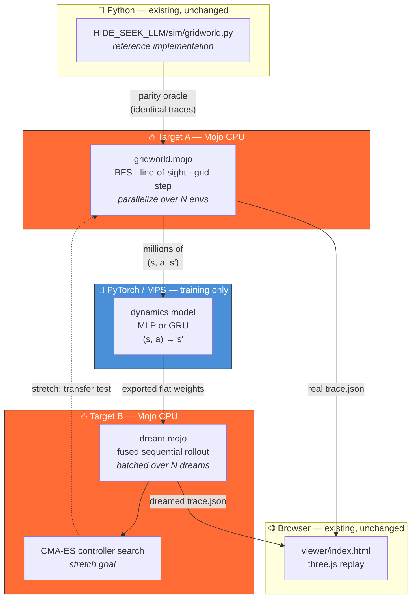

# 🗺️ PLAN — Mojo World Models

The decision ledger. Same format as `HIDE_SEEK_LLM/PLAN.md`: decisions are recorded
once and amended in place; deferred ideas live in the branch ledger so they don't
get lost or silently re-litigated.

*Created 2026-08-06.*

---

## 🎯 Goal

Build a **world model** over the `HIDE_SEEK_LLM` gridworld — learn its transition
function from traces, then throw the real simulator away and run agents inside the
learned model — and use **Mojo** for the two compute-bound halves.

The deliverable is a measurement, not a framework:

> **Where does Mojo actually beat the Python/PyTorch stack, and by how much,
> on an honest baseline?**

---

## 💡 Thesis

`MOJO_STUFF/MOJO_CURRICULUM` already measured the **big-dense-matmul** regime on
this machine, and Mojo *loses* there:

| Workload (`RESULTS01.md`) | GFLOP/s |
|---|---|
| PyTorch MPS (tuned) | **13,381** |
| Mojo Apple GPU (best tuned kernel) | ~4,300 |
| Mojo Apple GPU (naive) | 2,684 |

Tuned Mojo trails MPS by ~3.1×, and the naive GPU kernel lost outright to Apple's
Accelerate BLAS on CPU. Chasing matmul throughput is a bet we would lose.

But `04b_train_mlp_gpu.mojo` measured the **crossover**: at `N=256, H=16` the GPU is
~**30× slower** than CPU (kernel-launch overhead swamps the arithmetic); at
`N=8192, H=1024` it is ~**15× faster**.

A world-model dream loop lives squarely in the *first* regime — a tiny state vector,
a tiny MLP, and **millions of strictly sequential steps**, where per-step dispatch
overhead is the entire cost. The gridworld simulator is even further from BLAS's
comfort zone: branchy integer BFS and line-of-sight raycasting that nobody would
vectorize.

**So this project measures the small-sequential-branchy regime that the curriculum
didn't.** It is the complement of `RESULTS01.md`, not a rerun — and the prediction
that Mojo wins here comes from the curriculum's own crossover data rather than from
intuition.

**The obvious objection, answered up front:** *if Mojo makes the ground-truth sim
100× faster, why learn a world model at all?* Because (a) the sim is a stand-in for
a world you don't have, and (b) the learned model is **differentiable** and the
hand-written simulator is not.

---

## 🏗️ Architecture

**The key structural bet:** both Mojo halves emit the **same `trace.json` schema** the
Python sim already produces, so the existing three.js viewer renders real and dreamed
episodes with zero changes. Side-by-side divergence becomes a free demo.

---

## ✅ Decisions (resolved 2026-08-06)

### The six framing decisions

| # | Question | Decision | Why |
|---|---|---|---|
| 1 | Observation modality | **Symbolic state, no VAE** | The gridworld has clean symbolic state. The Mojo-interesting part — the dynamics rollout loop — is identical either way. Pixels are a worse fit here than on a natively-pixel env. → **B1** |
| 2 | Is the LLM in the loop? | **No, not in v1** | Frozen weights means nothing learns from the LLM's presence. It costs money, needs the Argo tunnel, and yields ~24 transitions per call-heavy episode. Random + scripted policies give millions for free. → **B2** |
| 3 | Headline result | **Speedup primary · fidelity as gate · transfer as stretch** | Speedup is defensible regardless of how the RL turns out. Fidelity is mandatory anyway (fast garbage is still garbage) and cheap, since the viewer exists. Transfer is the thing to want, not to promise. |
| 4 | Scope | **Both targets, A first** | Not completeness — dependency. A generates the training data B needs. A is also the guaranteed-to-land result, so there's something to show even if B gets hard. |
| 5 | Gradients in Mojo | **None — CMA-ES for the controller** | Evolution is gradient-free and its inner loop (evaluate hundreds of rollouts, rank them) is the single best-fit Mojo workload in the project. It is also what Ha's original paper used. → **B4** |
| 6 | CPU or GPU | **CPU-only for v1** | BFS/LOS is branchy and GPU-hostile; the dream loop is small-and-sequential, exactly where `04b` measured the GPU losing by 30×. CPU is the right answer here, not a compromise. |
| 7 | What is one transition? | **One tick at `move_budget: 1`** | At the demo's `move_budget: 8`, a turn is plan-then-walk and `_plan` applies `grab`/`lock` *instantly* before the walk — so mid-walk frames carry the remaining path as **hidden state and are not Markov**. `move_budget` is already a config knob, so 1 is a *configuration*, not a fork. Also removes "learn BFS from a 25-scalar state vector," the likeliest cause of an M7 failure. |
| 9 | Where does M8 evolve controllers? | **In the real Mojo sim, not the dream** | M5 measured the crossover: CMA-ES evaluates hundreds of candidates per generation, which is the large-batch regime where PyTorch beats Mojo 3×. Against the *real* sim Mojo is 300× (M2). The dream is also only 6% faithful over a full episode, so a controller trained there would optimise against a fiction for most of it. |
| 8 | Relationship to `HIDE_SEEK_LLM` | **Vendor a copy** | `DEMO/` gets cleared out periodically and HIDE_SEEK_LLM isn't upstream of anything, so a self-contained project is safer than a path import — and it travels cleanly to `~/GitHub` later. |

### Design details that follow

- **Atomic actions, not macros.** Action set is `move N|S|E|W`, `grab`, `drop`,
  `lock[target]`, `unlock`, `wait`. `move_to` (a BFS macro) is excluded from the
  world-model action set; it stays available in the sim for the **B2** branch.
- **Where the time actually goes — measured, not assumed.** `cProfile`, 300 episodes × 100
  turns, grid 12 (0.488 s total, ~16 µs/turn):

  | | tottime | share |
  |---|---|---|
  | `emit_frame` | 0.069 s | 14% |
  | `resolve_turn` | 0.057 s | 12% |
  | `bfs_path` | 0.055 s | 11% |
  | `occupied_cells` (43,320 calls) | 0.041 s | 8% |
  | `_plan` | 0.037 s | 8% |
  | `seen_map` + `line_clear` + `occludes` | 0.018 s | ~4% |

  **This refuted two earlier guesses.** BFS is *not* cheap at `move_budget: 1` (11%, third
  highest) — the adjacent-goal shortcut is real, but `bfs_path` rebuilds the whole
  `occupied_cells()` set on every call, and that dominates the search itself. And **LOS is
  not a hotspot at all** (~4%): `seen_map` no-ops during prep, which is half the episode,
  and `line_clear` only runs inside vision range.

  The honest characterization: **there is no single hotspot.** Cost is diffuse Python
  interpreter tax — set/dict/list allocation and attribute lookup spread across the sim. That
  is the textbook case for a compiled language: no algorithmic win on offer, just a constant
  factor. Claim it that way.
- **No optimized-Python row.** Tempting as strawman insurance, but the profile prices it:
  memoizing `occupied_cells` per tick and skipping trace dicts removes ~22%, i.e. ~1.3×, while
  the remaining ~70% is thin interpreter overhead with no concentrated target. Report the
  estimate instead of building it.
- **State vector (~25 scalars).** Hider pos, seeker pos, carry flags, 3 × box `(pos, locked)`,
  ramp `(pos, locked)`, phase, turn index. Walls are static per seed — passed as a
  144-bit mask, not learned.
- **Data mix — four arms, as built** (the original plan said three plus a port of
  `demo_corner_fort.py`; the port was dropped as redundant once arm B existed):

  | arm | what it does | why | current mix |
  |---|---|---|---:|
  | A `random` | random policy | broad state coverage — what Ha does | 40,000 |
  | B `prelocked_fort` | corner seal locked at t=0, hider inside | **load-bearing**: random *and* build-biased play produced **zero** seals in 80k episodes | 20,000 |
  | C `build_biased` | grab/lock weights up 2× | intended to give fort-building *trajectories*; **measured as a failure** — still zero seals | 15,000 |
  | D `box_in_reach` | box parked beside hider, weights favour *holding* | M4 measured carry as the worst subset (64.7%); this took it to 77.3% | 25,000 |

  Arm D's first version reused C's weights and did nothing — locks were 52% of that
  distribution, so the hider dropped the box ~2 turns after grabbing. Grabbing was never the
  bottleneck; holding was.
- **Parity is compared on a digest, not on JSON.** Both sims emit a canonical one-line-per-frame
  text digest; the M1 gate diffs those. Avoids chasing JSON float/key-order formatting
  differences that have nothing to do with simulation correctness. `trace.json` is written
  separately, for the viewer.
- **RNG never crosses the language boundary.** `random.Random` appears only in
  `_spawn`/`_free_cell`; everything downstream is deterministic. Python generates the map and
  the action sequence and exports both; Mojo replays them. No Mersenne Twister in Mojo.
- **Trace schema — frozen contract.** Keep `HIDE_SEEK_LLM`'s format verbatim:
  `{meta{grid, prep_turns, total_turns, frames}, walls[[x,y]], frames[{t, turn, phase,
  agents[{id, team, pos, face, carry, act, seen}], boxes[...]}], result{hider_reward, winner},
  memos{}}`. Dreamed episodes populate the same fields; `memos` stays empty in v1.
- **Toolchain.** Mojo **1.0.0b2** (`/Users/rbutler/VENVS/BASE/bin/mojo`). Copy the
  `pyproject.toml` + `uv.lock` + `uv run mojo` pattern from `MOJO_STUFF/MOJO_HARNESS`.
  Python↔Mojo boundary per the `mojo-python-interop` skill.
- **Location.** Stays at `~/Desktop/DEMO/MOJO_WORLD_MODELS` until there is a demo worth
  handing to colleagues, then moves to `~/GitHub/MOJO_STUFF/MOJO_WORLD_MODELS` alongside
  its siblings.

---

## 📏 Benchmark protocol

The speedup claim is the headline, so the protocol is a first-class artifact, not an
afterthought. **Two targets, two different honest baselines.**

| | Target A — gridworld sim | Target B — dream rollout |
|---|---|---|
| Workload | BFS, LOS raycasting, grid mutation | small fused MLP/GRU step, ×millions |
| Shape | branchy integer, not vectorizable | sequential tiny matmuls |
| **Fair baseline** | **the existing pure Python** `gridworld.py` | **NumPy and CPU PyTorch** |
| Expectation | large win (30–100×) | win from fusion + batching, *not* from beating BLAS |

**Rules, to keep it honest:**

1. **Pin the device.** Mojo runs on CPU in v1, so the baseline runs on **CPU**. The global
   config defaults PyTorch to MPS, so this *will* happen by accident unless forced —
   the harness records `device` per run and **refuses to compare across devices**.
   MPS numbers may be reported, in their own row, clearly labelled.
2. **No strawman.** Target A's baseline is the real existing Python because vectorizing
   BFS/LOS is not what anyone would actually do. Target B's baseline is *vectorized*
   NumPy and batched PyTorch, because there it is.
3. **Parity before performance.** Target A is only benchmarked after it reproduces the
   Python sim's traces **exactly** on shared seeds. A fast simulator that disagrees is
   not a result.
4. **Report the loss cases too.** If Mojo loses a configuration, that row stays in the
   table. The crossover is the interesting finding, and `RESULTS01.md` set the precedent.
5. **Verification stays outside the timed region.** Learned the hard way at M2: a checksum
   folded per-field inside the hot loop cost one inlined multiply in Mojo and a Python
   function call per field, inflating the speedup by ~33%. The tell was an ordering
   violation — the mode doing *less* work timed *slower*. Check for that explicitly; a
   favourable number is not self-validating.

---

## 🪜 Milestones

| | Milestone | Gate |
|---|---|---|
| **M0** | ✅ Scaffold: `uv` + Mojo project, toolchain verified | `uv run mojo` builds |
| **M1** | ✅ `gridworld.mojo` — Target A, CPU | bit-identical traces vs Python on shared seeds |
| **M2** | ✅ Benchmark A → [RESULTS_M2.md](RESULTS_M2.md) | speedup table, Mojo vs pure Python |
| **M3** | ✅ Data generation → [RESULTS_M3.md](RESULTS_M3.md) | coverage report incl. fort-shaped states |
| **M4** | ✅ Dynamics model → [RESULTS_M4.md](RESULTS_M4.md) | held-out next-state accuracy |
| **M5** | ✅ `dream.mojo` → [RESULTS_M5.md](RESULTS_M5.md) | matches PyTorch inference numerically |
| **M6** | ✅ folded into [RESULTS_M5.md](RESULTS_M5.md) — batch crossover | speedup table, device-pinned |
| **M7** | ✅ divergence measured at M5; `viewer/compare.html` renders real vs dreamed | dream tracks reality for K steps |
| **M8** | ✅ sep-CMA-ES controller → [RESULTS_M8.md](RESULTS_M8.md) | non-trivial reward in the **real** sim |

M1–M2 are the guaranteed result. M7 is the demo. M8 is the one allowed to fail.

---

## 🚫 Non-goals

- Beating PyTorch/MPS at large dense matmul — already measured, already lost, not the point.
- A general Mojo ML framework. This is one env and one dynamics model.
- Continuous physics / MuJoCo. Inherited from `HIDE_SEEK_LLM`'s non-goals.
- Fine-tuning any LLM.
- GPU kernels in v1.

---

## 🌿 Deferred branch ledger

Live alternatives, parked deliberately. Each records what unblocks it.

- **B1 — Pixel / VAE arm.** Render the grid to 64×64 and train a real variational
  autoencoder, for a paper-faithful three-component world model.
  *Unblocked by:* M7 passing. *Note:* CarRacing (**B3**) is the better vehicle — natively
  pixels, so it gets B1 for free rather than bolting synthetic pixels onto a grid.
- **B2 — LLM back in the loop.** Run `HIDE_SEEK_LLM`'s memo autocurriculum against the
  **dream** instead of the sim. The headline experiment of the whole idea.
  *Unblocked by:* M7 — the dream must be demonstrably faithful first. The sim already has
  a clean step interface, so it is close to a one-line swap.
- **B3 — CarRacing as a second env.** The original paper's benchmark. Natively pixel-based.
  *Unblocked by:* M6, plus wanting B1.
- **B4 — Mojo-native training.** Upgraded from "rabbit hole" to "cheap":
  `MOJO_CURRICULUM/04_train_mlp.mojo` is hand-derived backprop **verified against NumPy to
  6 figures** (`2.178 → 0.000561` over 300 epochs), with a working GPU twin in `04b`. Training
  the dynamics model in Mojo means cribbing an existing verified file, not inventing autograd.
  Still deferred — CMA-ES stands for v1 — but no longer speculative.
- **B5 — GPU arm.** Metal on the M4 Max is confirmed working. Only worth it if batching
  pushes the dream loop past `04b`'s measured crossover.

---

## 🔭 Open questions

1. ~~Dynamics architecture — MLP or GRU?~~ **Answered at M4: MLP.** Decision 7 made states
   Markov by construction and the sim is deterministic, so a GRU has no hidden state to
   carry. Remaining error is capacity, not architecture: 0.46 M params → 91.85%,
   5.3 M → 93.0%.
2. ~~How many transitions is enough?~~ **Answered at M4: ~1.5 M.** The accuracy curve is dead
   flat from 1.5 M to 9.5 M, so the 10 M dataset is 6.7× larger than needed.
3. Fidelity metric for M7 — exact state match, per-field accuracy, or steps-until-divergence?
   Leaning steps-until-divergence: one number, and it animates well in the viewer.
   **M4 makes this urgent rather than cosmetic** — at 93.0% per step, an exact trajectory
   survives ~10 steps, so M7 is now "how far does a 93% dream get" rather than a formality.
4. Does the dream need to model the *seeker* too, or is the seeker part of the environment
   from the hider's point of view? (Affects the state vector and the CMA-ES setup at M8.)
5. ~~Is ~93% per-step good enough to be worth a Mojo dream?~~ **Partly answered at M5.**
   Better than feared — median survival is 49 steps, not the ~10 that naive compounding
   predicted, because errors are concentrated rather than independent. But only 6% of dreams
   survive a full 100 turns, so an accuracy push is still a prerequisite for M8.
6. ~~Should M8 evolve in the real sim rather than the dream?~~ **Answered: real sim.**
   See decision 9.
7. **New, raised by decision 9 — a framing problem, not a technical one.** Ha's thesis is
   that an agent can be trained *entirely inside the learned model* with the real environment
   severed. Evolving in the real sim abandons exactly that claim, so M8 becomes a
   demonstration of **Mojo throughput**, not of world models. The world-model result then
   rests solely on M5's fidelity measurement.
   **Recommended fix, cheap:** run BOTH arms through one ES harness — evolve in the real sim
   (primary) *and* in the dream (secondary), then evaluate both in the real sim. Same code,
   two backends, and it measures the actual quantity of interest: what training in a
   49-step-faithful dream costs you. That converts "we gave up on the dream" into "we priced
   it."
   **✅ ANSWERED — see [RESULTS_OQ7.md](RESULTS_OQ7.md). The dream transfers nothing.**
   Evolved in the dream and scored in reality: **0.241 vs 0.237 for standing still**, while
   the real-sim arm on an identical budget reached 0.393. Dream fitness climbed 0.30 → 0.57
   over 50 generations while real held-out never moved — model exploitation, not learning.
   And it was **98× slower** than the simulator it replaces (232.5 s vs 2.4 s).
   Setup below was built as described. `evolve.mojo` takes a `real|dream` backend and
   both arms share one featuriser, one seeker, one optimiser and identical spawn states — the
   only difference is where the next state comes from. Held-out fitness is always scored in
   the REAL sim regardless of which backend trained.
   Key distinction the experiment turns on: **the dream is a good evaluator but that does not
   make it a good training signal.** Scoring a fixed policy keeps you near the training
   distribution (measured: a real-trained champion scores 0.598 in the dream vs 0.630 in
   reality, and 0.3725 vs 0.3925 at the smaller budget — within ~5%). *Optimising against*
   the dream instead pushes deliberately toward states where the model is wrong, which is the
   classic model-based RL failure mode. **Confirmed exactly:** the dream is a 5%-error
   evaluator of a *fixed* policy and a worthless training signal for an *optimised* one.

## ⚠️ Note on decision 5 (CMA-ES)

Full CMA-ES maintains an n x n covariance and eigendecomposes it each generation. At ~600
controller parameters that is a 600x600 decomposition per generation and needs LAPACK, which
is a large amount of Mojo for an optimiser that is not what this project is measuring.
**Use separable CMA-ES** (diagonal covariance, O(n) per generation) — a standard, cited
variant, so decision 5 stands in substance. Record it as sep-CMA-ES, not CMA-ES.

---

## 🔌 Notes

- **macOS TCC.** `~/Desktop`, `~/Documents`, `~/Downloads` are privacy-protected; the Mojo
  REPL `dlopen`s `libMSupportGlobals.dylib` at runtime and gets **SIGKILL**ed (exit 9) with
  a `file system sandbox blocked open()` wall. It reads like a broken install; reinstalling
  does not help; `mojo file.mojo` is unaffected, which makes it worse.
  **Not currently an issue** — iTerm2 already has Full Disk Access (granted 2026-07-05),
  verified from this directory on 2026-08-06 (`mojo repl` returned `42`, exit 0). Only
  relevant on a fresh machine or a different terminal app. See
  `MOJO_STUFF/MOJO_CURRICULUM/mac_local_check.sh`.
- **Origin.** Sparked by `world_model_transcript.txt` (Kilobright's Code, on David Ha's
  2018 world models paper — VAE + MDN-RNN + controller, <5M params total).

---

## ⚠️ Known gaps

- **`bfs_step`'s unreachable-goal fallback is unexercised.** At `move_budget: 1` the goal is
  always adjacent and `bfs_path` discards it from `blocked`, so BFS always reaches it and the
  nearest-reachable-cell fallback never fires. It is ported and parity-checked *by
  construction*, not by test. It becomes live under **B2** (`move_budget: 8`, sealed forts) —
  write a targeted test before relying on it there.

---

## 📓 Changelog

- **2026-08-06** — Brainstorm and scoping session. Six framing decisions resolved
  (symbolic / no-LLM / speedup-first / both-targets-A-first / no-autograd / CPU-only).
  Planned Apple-GPU spike **cancelled**: already answered by `MOJO_CURRICULUM`, whose
  `RESULTS01.md` also inverted the initial Target-B assumption (PyTorch MPS beats tuned
  Mojo GPU matmul by ~3.1×) and whose `04b` crossover data supplied the actual thesis.
  Confirmed the Desktop/TCC gotcha is already resolved on this machine.
- **2026-08-06** — Decisions 7 (one tick at `move_budget: 1`) and 8 (vendor a copy) resolved.
  **M0 and M1 complete.** `mojo/gridworld.mojo` compiled clean first try and reproduces the
  vendored Python sim **byte-for-byte across 1,100 episodes** (200×40 turns on grid 12, plus
  300×100 turns each on grids 8/16/24), with all 11 tracked code paths exercised. Recorded the
  honest correction that Target A's win comes from `occupied_cells()` and Bresenham LOS rather
  than BFS. Next: **M2**, the Target A benchmark.
- **2026-08-06** — **M2 complete** → [RESULTS_M2.md](RESULTS_M2.md). Mojo sim is **30.9×**
  single-threaded and **299.6×** across 12 performance cores (81% parallel efficiency) vs the
  Python reference, CPU-to-CPU, with all 40,400 frames of trace text verified identical. With
  trace serialization the win narrows to 12.5×, because Mojo's `String` concatenation costs
  3.42× its own core time against Python's 1.38× — logged, not on M3's critical path.
  Profiling **refuted two pre-registered guesses** (BFS is 11%, not cheap; LOS is 4%, not a
  co-hotspot) and replaced them with the measured "diffuse interpreter tax" characterization.
  Also caught and fixed a harness bug that had inflated the core speedup to 33.2× — see
  benchmark protocol rule 5. Next: **M3**, data generation.
- **2026-08-06** — **M3 complete** → [RESULTS_M3.md](RESULTS_M3.md). `data/train`: 100k
  episodes × 100 turns = **10.1 M state vectors in 1.16 s**. Mojo now generates maps and
  actions itself via an LCG shared with Python (same constants as
  `MOJO_CURRICULUM/04_train_mlp.mojo`); `python/gen_gate.py` verifies 60/60 episodes
  element-identical across all three arms. Coverage: 100% of free cells, 96.8% unique states,
  13.5% sealed-fort frames. **Arm B was load-bearing** — random *and* build-biased play
  produced zero seals in 80k episodes, so arm C failed its stated purpose and every fort state
  comes from pre-locked spawns. Also fixed: no transitions *into* a seal existed until arm B
  started handing the hider a box (now 1,075). Known thin spot left untuned on purpose:
  carrying is 1.0% of frames — M4's accuracy curve decides whether that matters.
  Next: **M4**, the dynamics model.
- **2026-08-06** — **M4 complete** → [RESULTS_M4.md](RESULTS_M4.md). MLP (5.3 M params,
  24 softmax heads, one per state field) reaches **93.0% exact-match** next-state accuracy on
  episode-held-out data, trained in 160 s on MPS. **Open questions 1 and 2 both answered**
  (MLP not GRU; ~1.5 M transitions saturate, so M3's 10 M was 6.7× oversized). M3's deferred
  carry weakness was confirmed real (64.7% vs 93.4% overall) and fixed by a fourth generation
  arm — first attempt failed because it reused build-biased weights and the hider dropped the
  box in ~2 turns; carry-biased weights took it to **77.3%** (+12.6 pp).
  **Headline finding: 93.0% per step compounds to ~48% at 10 steps and 0.1% at 100**, so a
  full-length dream cannot survive. Logged as new open question 5 — decide whether M5 needs
  an accuracy push first. Next: **M5**, the Mojo dream rollout.
- **2026-08-06** — **M5 complete (and M6 with it)** → [RESULTS_M5.md](RESULTS_M5.md). Mojo
  dream matches PyTorch **100.0000%** across 20k steps. Closed-loop survival: **median 49
  steps**, mean 40.9, 6% reach 100 — nearly 5× better than M4's naive compounding estimate,
  because errors are concentrated in hard regions rather than independent. **Speed crossover
  at batch ≈ 32**: Mojo wins up to 4× at 1–16 concurrent dreams, PyTorch wins up to 3× beyond
  — the project thesis, measured. SIMD-widening the dot product took Mojo from 398 to
  25.9 µs/step (15×) so the comparison is not a reverse strawman. One bug worth remembering:
  the first run read 0.00% survival because frame *k* carries turn *k−1* (emit_frame precedes
  the increment), and **both** implementations shared the error — gate 1 passed at 100% while
  the dream was nonsense. Cross-implementation agreement proves consistency, not correctness.
- **2026-08-06** — **M8 complete** → [RESULTS_M8.md](RESULTS_M8.md). Decision 9 taken: evolve
  in the real Mojo sim. sep-CMA-ES over a 598-param linear controller reaches **0.658
  held-out** vs 0.264 for standing still — **940,800 rollouts / 94 M turns in 5–11 s**
  (≥70× a Python equivalent), which is where M2's speedup cashes out.
  **Key negative result: `grab` is never chosen and no fort is ever built (0 of 128).** The
  0.658 is pure evasion. This is the same wall M3 hit — random and build-biased play produced
  zero seals in 80k episodes, and now 150 generations of CMA-ES produce zero too. Structural,
  not tuning: every intermediate step of fort-building scores zero or negative reward, so
  there is no gradient to climb, and a memoryless linear policy cannot hold a multi-step
  plan. Overfitting at 8 maps was caught only by the per-generation held-out column (train
  0.62, held-out flat at the static baseline); 128 maps fixed it.
- **2026-08-06** — **Open question 7 answered** → [RESULTS_OQ7.md](RESULTS_OQ7.md). Same
  controller evolved two ways at identical budget, both scored in the real sim: **dream-trained
  0.241 vs static 0.237 vs real-trained 0.393** — the dream captured 2.4% of the achievable
  gain, i.e. nothing. Dream fitness rose 0.30 → 0.57 while reality stayed flat. Crucially the
  model is NOT broadly inaccurate: it scores a *fixed* controller within 5% of reality. It
  collapses only under optimisation, which searches for exactly where it is wrong. The
  dream-trained champion also failed to generalise *within the dream* (0.570 train vs 0.253
  held-out maps), while the real arm on the same 32 maps generalised fine — so this is model
  exploitation, not map-count overfitting. Also 98× slower than the sim it replaces.
  This does not refute Ha: world models pay when you cannot query the real environment, and
  M2 made this one nearly free. **Project-wide lesson, now the fourth instance: always keep
  one measurement the optimisation cannot touch.**
- **2026-08-06** — **M7 complete. All milestones M0–M8 done.** `python/make_trace.py` emits a
  real and a dreamed trace for the same episode, and `viewer/compare.html` plays them side by
  side. **The structural bet from the architecture section paid off exactly as designed:** the
  traces validate key-for-key against an upstream HIDE_SEEK trace at the top, frame, and agent
  levels, so the vendored three.js viewer renders dreams with **zero** changes — the single
  edit to `viewer.js` is a `?trace=` query parameter so two iframes can load different files.
  Note for anyone opening it: the viewer `fetch()`es its trace, which `file://` blocks on
  CORS, so serve the directory (`python3 -m http.server 8731`).
